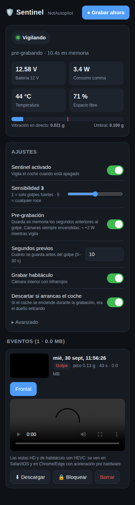
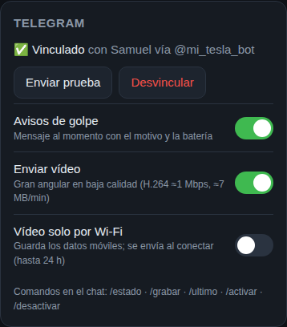

# NAP Sentinel

Modo vigilancia para **NotAutopilot** en comma 4 / comma 3X, pensado para cuando el coche está aparcado.

Si alguien golpea, levanta o balancea el coche, sentinel graba las cámaras (frontal, gran angular y habitáculo con infrarrojos) y te avisa por **Telegram** con el vídeo. Todo se gestiona desde un panel web en el propio comma: `http://<IP del comma>:8090`.



- Se instala **encima de tu NAP actual** con una línea. No hace falta cambiar de rama ni compilar.
- **Pre-grabación** opcional: el vídeo empieza unos segundos **antes** del golpe.
- **Telegram**: aviso con el motivo y la fuerza, vídeo de la gran angular y comandos como `/grabar` o `/estado`.
- **Destello de luces con la API de Tesla** al detectar un evento de noche, para que la grabación se vea mejor.
- **Si eras tú**, no hay aviso: al arrancar el coche durante la grabación, el evento se descarta.
- **Se actualiza desde el panel**: avisa cuando hay versión nueva en GitHub y la instala con un botón.
- **Sobrevive a las actualizaciones de NAP.** Mientras conduces no cambia nada.

<br clear="right">

## Índice

- [Instalar, actualizar y desinstalar](#instalar-actualizar-y-desinstalar)
- [Primeros pasos](#primeros-pasos)
- [Modos de vigilancia](#modos-de-vigilancia)
- [Avisos por Telegram](#avisos-por-telegram)
- [Destello de luces (API de Tesla)](#destello-de-luces-api-de-tesla)
- [Panel web](#panel-web)
- [Qué detecta](#qué-detecta)
- [Ajustes](#ajustes)
- [Energía](#energía)
- [Hora y zona horaria](#hora-y-zona-horaria)
- [Qué toca en el comma](#qué-toca-en-el-comma)
- [Solución de problemas](#solución-de-problemas)
- [Limitaciones y avisos](#limitaciones-y-avisos)
- [Historial de versiones](#historial-de-versiones)
- [Desarrollo](#desarrollo)

## Instalar, actualizar y desinstalar

Necesitas acceso SSH al comma. En el comma, ve a *Ajustes → Desarrollador → SSH* y añade tu usuario de GitHub. Después, desde tu PC, en la misma red que el comma: `ssh comma@IP_DEL_COMMA`.

**Instalar o actualizar**, siempre con el coche aparcado:

```bash
curl -fsSL https://raw.githubusercontent.com/valerito/nap-sentinel/main/dist/nap-sentinel-install.sh | bash
```

- El instalador pregunta si quieres reiniciar. Hay que reiniciar para que arranque la versión nueva.
  - `--yes`: instala y reinicia sin preguntar.
  - `--no-reboot`: no reinicia.
- Para **actualizar**, lo más fácil es el **panel web** (desde la 1.4.0): ver [Actualizar desde el panel](#actualizar-desde-el-panel). Por SSH se usa el mismo comando. Se conservan tus ajustes, el bot de Telegram y las grabaciones.
- Se puede actualizar con sentinel en marcha.
- La primera línea que imprime indica la versión (`NAP Sentinel 1.x.y`). Si sale una versión antigua, GitHub aún tiene la anterior en caché: espera un par de minutos y repite.

### Actualizar desde el panel

El panel comprueba en GitHub si hay una versión nueva al arrancar y cada 6 horas. También puedes comprobarlo a mano en *Ajustes → Avanzado → Buscar actualizaciones*, donde se ve la versión instalada.

1. Si hay una versión nueva, aparece un aviso azul arriba del todo: **🆕 Nueva versión X disponible**, con los botones *Novedades* y **Actualizar**.
2. **Actualizar** descarga el mismo instalador de la línea de `curl` y lo ejecuta en el comma (sin reiniciar). Tarda unos segundos; se conservan los ajustes, Telegram, Tesla y las grabaciones.
3. Al terminar, el aviso se pone verde: **✅ Actualizado a X**, con el botón **Reiniciar ahora**. Hasta que reinicies sigue funcionando la versión anterior.
4. **Reiniciar ahora** reinicia el comma igual que su botón de Ajustes. No se puede con el coche encendido. La página vuelve sola en uno o dos minutos.

Si falla, el aviso se pone rojo con el motivo, un botón *Reintentar* y el registro (también en `/data/sentinel/update.log`). La versión anterior sigue instalada y funcionando.

**Alternativa sin internet en el comma**: copia el archivo desde tu PC.

```bash
scp dist/nap-sentinel-install.sh comma@IP_DEL_COMMA:/data/
ssh comma@IP_DEL_COMMA 'bash /data/nap-sentinel-install.sh'
```

**Desinstalar.** NAP queda exactamente como estaba.

```bash
bash /data/sentinel/uninstall.sh            # pregunta si borrar las grabaciones
bash /data/sentinel/uninstall.sh --purge    # borra también las grabaciones
```

## Primeros pasos

1. Tras reiniciar, abre `http://IP_DEL_COMMA:8090` desde el móvil o el PC, en la misma red que el comma (el Wi-Fi de casa o el hotspot del comma).
2. Activa **Sentinel activado**.
3. Ajusta la **sensibilidad** mirando el medidor de vibración en directo.
4. Con el coche apagado, pulsa **Grabar ahora** y comprueba que aparece el evento con su vídeo.
5. Opcional: vincula **Telegram** (ver más abajo).
6. Opcional: pon una **contraseña** a la web en *Avanzado*.

Al apagar el coche, sentinel espera 90 s ("Armando"), para que te dé tiempo a salir y cerrar, y después pasa a **Vigilando**.

## Modos de vigilancia

| | Normal | Pre-grabación |
|---|---|---|
| Qué está encendido mientras vigila | Solo el acelerómetro y el giroscopio | Acelerómetro, cámaras y codificador |
| Consumo aparcado | El comma despierto, del orden de 1–2 W | ≈ +2 W continuos (`camerad` + `encoderd`) |
| Inicio del clip | ~2–3 s **después** del golpe | 5–30 s **antes** del golpe (10 por defecto) |

Se cambia desde la web con el interruptor **Pre-grabación**. Con pre-grabación, el vídeo tiene un botón **⏩ Ir al golpe**.

En pre-grabación, sentinel lee el vídeo que ya codifica el hardware (`encoderd`) y guarda en RAM los últimos N segundos, unos 30–40 MB para 10 s. Siempre empieza en un fotograma clave. Al detectar un evento, escribe ese búfer y sigue grabando en directo. No usa `loggerd`, así que los clips no se suben a comma connect.

Si el comma se calienta demasiado (estado térmico rojo), la pre-grabación se pausa y no se graba.

## Avisos por Telegram



**Vincular**, desde el panel web, sección **Telegram**:

1. En Telegram, abre **@BotFather**, envía `/newbot`, elige un nombre y copia el **token** que te da.
2. Pega el token en la web y pulsa **Guardar**.
3. Pulsa **Vincular mi Telegram**. Se abre tu bot; pulsa **Iniciar**.
   - Queda vinculado solo ese chat.
   - El enlace caduca a los 15 min.
   - Si Telegram está en otro dispositivo, envía al bot el `/start <código>` que muestra la web.
4. Pulsa **Enviar prueba** para comprobarlo.

**Qué recibes:**

- **Aviso de evento**: el motivo (💥 golpe, 📐 inclinación o ↔️ balanceo), la fuerza, la hora y la tensión de la batería.
  - Por defecto espera **30 s** antes de enviarse. Si en ese tiempo arrancas el coche, el evento se descarta y **no recibes nada**.
  - El tiempo se cambia en *Esperar antes de avisar*. Con 0, el aviso es inmediato.
  - La grabación manual (`/grabar` o *Grabar ahora*) avisa al instante.
  - Si arrancas el coche cuando el aviso ya se envió, llega un mensaje de "era el dueño, descartado".
- **Vídeo de la cámara gran angular** en baja calidad (H.264 ≈1 Mbps, ≈7 MB por minuto), como respuesta al aviso, en cuanto termina el clip.
  - Si usas pre-grabación, incluye los segundos anteriores al golpe. La miniatura sale del propio vídeo, en el momento del golpe.
  - Lo codifica el hardware del comma (`stream_encoderd`), que solo funciona mientras se graba, así que no gasta CPU.
  - Si por algún motivo no hay clip de la gran angular, se envía el de la frontal y el pie de foto lo indica.
  - Sin conexión, se reintenta durante 24 h. Opción **Vídeo solo por Wi-Fi** para no gastar datos móviles.
- **Comandos** desde tu chat (el bot ignora cualquier otro chat):

  | Comando | Qué hace |
  |---|---|
  | `/estado` | Estado de sentinel, batería, consumo, temperatura, horas aparcado y último evento |
  | `/grabar` | Graba un clip ahora (con el coche aparcado) |
  | `/ultimo` | Reenvía el vídeo del último evento |
  | `/activar` · `/desactivar` | Activa o desactiva sentinel |

**Si un vídeo no llega**, nunca falla en silencio:
- El motivo llega al chat y se ve en el panel: icono ✈️⚠️ en el evento y *Telegram → Registro de envíos*.
- Puedes reenviar cualquier evento con el botón **✈️ Telegram**.
- Si Telegram rechaza el vídeo, sentinel lo reintenta sin miniatura y, en último caso, lo manda como archivo.

El token del bot se guarda solo en el comma (`/data/sentinel/config.json`). No aparece en la web ni en los registros.

<br clear="right">

## Destello de luces (API de Tesla)

Al detectar un evento de noche, sentinel pide al coche un **destello de luces** a través de la API de Tesla, igual que el botón de la app. En el Model S de 2012–2014 las luces se quedan encendidas un rato, así que la grabación nocturna se ve mucho mejor. No toca el bus CAN del coche.

**Conectar**, en el panel web, sección **Luces (Tesla)**. Es el mismo sistema que usan TeslaMate y las apps de tokens:

Hazlo desde un **ordenador** con Chrome, Edge o Firefox. En el móvil no funciona si tienes la app de Tesla, porque el código se lo queda la app.

1. Pulsa **Iniciar sesión con Tesla**. Se abre la web oficial de Tesla en otra pestaña.
2. En esa pestaña, **antes de iniciar sesión**, pulsa **F12** y abre la pestaña **Console** (Consola).
3. Inicia sesión allí, con tu contraseña y, si lo tienes, el código 2FA. Sentinel nunca ve tu contraseña.
4. Al terminar, la página no cambia, pero en la consola aparece una línea roja: `Failed to launch 'tesla://auth/callback?code=…'`. Cópiala **entera**, pégala en el panel y pulsa **Terminar**.
   - En Firefox aparece una página de error: copia su dirección (empieza por `tesla://auth/callback?code=…`).
   - El código caduca en unos minutos: pégalo nada más verlo.
5. Si la cuenta tiene varios coches, elige el tuyo. Después pulsa **💡 Destello de prueba**.

¿Por qué hay que copiar una dirección, en vez de volver solo? Tesla solo devuelve el código a direcciones registradas. TeslaMate o MyTeslaMate tienen su propio dominio registrado en Tesla. El comma está en tu red local, sin dominio propio, así que se usa la misma dirección que la app de Tesla (`tesla://auth/callback`), que el navegador no sabe abrir, y ese último paso es manual. Tesla retiró en junio de 2026 la dirección que se usaba antes (`https://auth.tesla.com/void/callback`), y por eso la 1.3.x–1.4.0 daban el error *«The 'redirect_uri' supplied is not registered for this 'client_id'»*.

**Otras formas de conectar** (en el mismo panel):
- **Token de refresco** de la Owner API, generado con una app de tokens de Tesla.
- **Fleet API**: la URL de tu región o de tu proxy, el `client_id` de tu app de desarrollador y el token de refresco.
- **MyTeslaMate**: el enlace *Rellenar su URL* pone `https://api.myteslamate.com`. Luego pega el token de MyTeslaMate en *Token de acceso fijo*. Allí despertar el coche consume más créditos que una orden normal.

**Owner API o Fleet API.** *Iniciar sesión con Tesla* usa la **Owner API**. Tesla la está retirando cuenta a cuenta, pero en muchas cuentas sigue funcionando. Sentinel usa TLS 1.3, que es lo que ahora exige Tesla para dar tokens de Owner API. Si el destello de prueba devuelve 403, tu cuenta ya no la admite: usa Fleet API o MyTeslaMate.

**Cómo funciona:**

- **Cuándo destella**: *Solo de noche* (por defecto) o *Siempre*. La grabación manual solo destella si activas *También en grabación manual*.
- **Qué es "de noche"**: se calcula con la altura del sol (por debajo de −4°) en la ubicación del coche.
  - La ubicación sale del **último GPS del comma**, que se guarda al conducir, o de una latitud/longitud manual (por defecto, Madrid).
  - El panel muestra si ahora es de día o de noche.
- **Si el coche está dormido**, primero se despierta. El destello llega a los **10–40 s** del golpe. Con pre-grabación, el vídeo incluye lo anterior.
- **Límites**: un destello por evento y como máximo 6 por hora.
- **Avisos**: el aviso de Telegram indica "💡 Destello de luces enviado". El resultado queda en el panel.
- **Token**: Tesla lo rota en cada uso y sentinel guarda siempre el último. Los tokens solo están en `/data/sentinel/config.json`. No aparecen en la web ni en los registros.

## Panel web

`http://IP_DEL_COMMA:8090`, desde cualquier dispositivo en la misma red.

- **Estado**: vigilando, armando, grabando o conduciendo. También muestra la batería de 12 V, el consumo, la temperatura, el espacio libre y, en pre-grabación, los segundos en memoria.
- **Vibración en directo** frente al umbral, para calibrar la sensibilidad.
- **Eventos** con miniatura, motivo, fuerza, duración y estado del envío a Telegram. Para cada evento:
  - Reproductor con pestañas por cámara: Frontal, Habitáculo, Gran angular, Gran angular (ligera) y Frontal HD.
  - Botones ⏩ Ir al golpe, ⬇ Descargar, ✈️ Telegram, 🔒 Bloquear (nunca se borra automáticamente) y Borrar.
  - Si alguna cámara no se pudo convertir, el evento muestra el motivo.
- **Ajustes**, **Luces (Tesla)** y **Telegram**.
- **Actualizaciones**: aviso arriba cuando hay versión nueva, con botón para actualizar y luego para reiniciar. La versión instalada se ve junto al título.

Los vídeos HD y de habitáculo son HEVC: se ven en Safari/iOS y en Chrome/Edge con aceleración por hardware. La frontal y la gran angular ligeras (H.264) se ven en cualquier navegador.

## Qué detecta

- **Golpe:** aceleración filtrada paso alto. El umbral depende de la sensibilidad: 1 = 0,30 g · 2 = 0,18 g · 3 = 0,10 g · 4 = 0,06 g · 5 = 0,035 g.
- **Inclinación:** cambio lento del vector de gravedad (gato, grúa). 1,5° por defecto.
- **Balanceo:** giroscopio, con el sesgo del sensor eliminado.
- **Manual:** *Grabar ahora* en la web o `/grabar` en Telegram.

Cada golpe nuevo durante una grabación alarga el clip, hasta 3 minutos. Si arrancas el coche durante la grabación, el clip se descarta porque eras tú. Se puede desactivar.

## Ajustes

Se cambian en la web o en `/data/sentinel/config.json`.

| Clave | Defecto | |
|---|---|---|
| `enabled` | false | Activa sentinel |
| `sensitivity` | 3 | 1–5 |
| `prerecord` / `prerecord_s` | false / 10 | Pre-grabación y segundos previos (5–30) |
| `clip_s` | 45 | Segundos tras el golpe; cada golpe nuevo lo alarga (máx. 180) |
| `arm_delay_s` | 90 | Tiempo para salir y cerrar antes de armarse |
| `tilt_deg` | 1.5 | Umbral de inclinación |
| `record_cabin` / `record_wide` / `record_hd` | true | Qué cámaras grabar en HD (la frontal ligera se graba siempre) |
| `discard_on_drive` | true | Descartar el clip si arrancas durante la grabación |
| `max_storage_gb` | 10 | Espacio máximo; borra primero los eventos antiguos no bloqueados |
| `low_voltage` | 11.8 | Por debajo, el comma se apaga para proteger la batería de 12 V |
| `max_parked_hours` | 0 | Apagar tras X horas aparcado (0 = nunca) |
| `web_password` | "" | Si se define, la web pide contraseña (cualquier usuario) |
| `tesla_flash` | false | Destello de luces con la API de Tesla en los eventos |
| `tesla_flash_when` | night | `night` (solo de noche) o `always` |
| `tesla_flash_manual` | false | Destellar también en las grabaciones manuales |
| `location_source` | gps | `gps` (último GPS del comma) o `manual` (`latitude`/`longitude`) |
| `night_sun_elevation` | -4 | Altura del sol (°) por debajo de la cual se considera de noche |
| `timezone` | Europe/Madrid | Zona horaria de los avisos de Telegram y los nombres de eventos |
| `telegram_alerts` | true | Enviar el aviso de evento |
| `telegram_alert_delay_s` | 30 | Segundos de espera antes de avisar; si arrancas en ese tiempo no se avisa (0 = inmediato) |
| `telegram_video` | true | Enviar el vídeo de la gran angular ligera |
| `telegram_video_wifi_only` | false | Esperar a tener Wi-Fi para enviar el vídeo |

## Energía

- Con sentinel activo, openpilot **no se apaga** a las 30 h ni por su batería virtual.
- Se mantiene un **corte real por tensión**: 11,8 V filtrados durante 45 s. Además, no se graba por debajo de 11,9 V.
- Opcionalmente, puedes apagar el comma tras X horas aparcado.
- Si el comma está demasiado caliente, no graba.
- **Consumo en la web**: el comma 3X da su consumo directamente. En el comma 4 ese sensor no existe, así que se calcula con la tensión y la corriente de entrada. Al pasar el ratón por encima se ve de dónde sale el dato. Si un modelo no da ninguna medida, aparece "–".

## Hora y zona horaria

El comma pone su reloj con el GPS o por NTP. Aparcado en un garaje, sin cobertura GPS, puede quedarse con una hora muy desfasada (meses). Eso afecta a los nombres de los eventos y a las horas de los avisos. Sentinel la corrige de tres formas:

- **Automática con Telegram**: cada vez que habla con los servidores de Telegram, compara la hora y la corrige si difiere más de 1 minuto.
- **Desde el panel web**: si la hora del comma difiere más de 2 minutos de la de tu móvil o PC, aparece un aviso amarillo con el botón **Poner la hora de este dispositivo**.
- **Manual por SSH**: `sudo date -u -s "2026-09-30 15:00:00"` (hora UTC).

La **zona horaria** se elige en *Avanzado → Zona horaria* (por defecto `Europe/Madrid`). Se usa para las horas de Telegram y los nombres de los eventos nuevos. La web muestra las horas en la zona de tu navegador.

## Qué toca en el comma

| Dónde | Qué |
|---|---|
| `/data/sentinel/` | El programa, tu `config.json`, el registro de Telegram y el de la última actualización (`update.log`). Está fuera de openpilot, así que no le afectan las actualizaciones de NAP. |
| `/data/openpilot/system/manager/process_config.py` | 12 líneas al final (el "gancho"), dentro de `try/except`: si sentinel falla o no está, openpilot arranca igual que siempre. |
| `/data/continue.sh` | 1 línea que vuelve a poner el gancho en cada arranque. |
| Param `DisablePowerDown` | Activado mientras sentinel está activado. Se restaura al desactivarlo o al desinstalar. |
| `/data/media/0/sentinel/` | Las grabaciones. |

**Actualizaciones de NAP:** al actualizar, el gancho desaparece. Sentinel lo vuelve a añadir de dos formas:
- `continue.sh` lo pone en cada arranque, antes de que openpilot arranque. También lo pone en la actualización pendiente de instalar, así que ya está presente cuando se aplica.
- Sentinel lo comprueba cada 10 minutos.

**Mientras conduces:** el gancho solo amplía las condiciones con el coche apagado, para `sensord`, `camerad`, `encoderd` y `stream_encoderd`. Con el coche encendido, todo funciona exactamente como en NAP sin modificar, y nunca se arranca ningún proceso de control.

## Solución de problemas

```bash
cat /dev/shm/nap_sentinel_status.json                 # estado en vivo de sentineld
cat /data/sentinel/VERSION                            # versión instalada
ls -la /data/media/0/sentinel/<evento>/               # ficheros de un evento
cat /data/media/0/sentinel/<evento>/event.json        # detalles (fotogramas, errores de exportación)
cat /data/media/0/sentinel/<evento>/telegram.json     # estado del envío a Telegram
tail -50 /data/sentinel/telegram.log                  # registro de Telegram
cat /data/sentinel/update.log                         # última actualización desde el panel
```

| Síntoma | Qué mirar |
|---|---|
| La web no carga | ¿Estás en la misma red? ¿Reiniciaste tras instalar? `grep nap-sentinel /data/openpilot/system/manager/process_config.py` debe mostrar el gancho. |
| Telegram no manda el vídeo | Icono ✈️⚠️ del evento o *Registro de envíos*. `event.json` → `export_errors` indica qué cámara no se pudo convertir. |
| No recibo el aviso | ¿Arrancaste el coche en los primeros 30 s? Entonces se descartó a propósito. Revisa *Esperar antes de avisar*. |
| Demasiados avisos | Baja la sensibilidad o sube *Esperar antes de avisar*. |
| Tesla dice *«The 'redirect_uri' supplied is not registered…»* | Actualiza a 1.4.1 o posterior. |
| El destello no funciona | Prueba **💡 Destello de prueba** en el panel; el error dice si es el token (403: tu cuenta ya no admite Owner API, prueba Fleet API), el coche sin conexión o que no despertó. |
| Consumo "0,0 W" o "–" | Actualiza a 1.1.6+. Pasa el ratón por el valor para ver de dónde sale la medida. |
| Horas o nombres de eventos con fecha rara | La hora del comma está mal: usa el botón del aviso amarillo de la web (ver [Hora y zona horaria](#hora-y-zona-horaria)). |
| El instalador muestra una versión vieja | Caché de GitHub: espera un par de minutos y repite. |
| No aparece el aviso de versión nueva | Necesita internet en el comma. Pulsa *Buscar actualizaciones* en *Ajustes → Avanzado*: si no puede, dice por qué. Las versiones anteriores a la 1.4.0 hay que actualizarlas una vez por SSH. |
| La actualización falla | El aviso rojo muestra el motivo y el registro (`/data/sentinel/update.log`). Sigue funcionando la versión anterior; puedes reintentar o usar el comando `curl` por SSH. |

## Limitaciones y avisos

- Las pruebas reales se han hecho en un comma 4 con NotAutopilot. El README de NAP solo lista el 3X, pero el código de NAP ya incluye la interfaz del comma 4.
- Para acceder a la web desde fuera de casa necesitas una VPN en el comma (p. ej. Tailscale), que no está soportada oficialmente en AGNOS. Telegram funciona desde cualquier sitio.
- Viento fuerte, lluvia intensa o camiones pasando pueden provocar disparos con sensibilidad 4–5.
- Legal (España): grabar la vía pública desde un coche aparcado es videovigilancia (RGPD/AEPD). Graba solo ante eventos y no difundas los vídeos.

## Historial de versiones

| Versión | Cambios |
|---|---|
| 1.4.1 | «Iniciar sesión con Tesla» vuelve a funcionar: Tesla retiró la dirección `void/callback`; ahora se usa `tesla://auth/callback` y se copia desde la consola del navegador. |
| 1.4.0 | Actualizaciones desde el panel web: aviso cuando hay versión nueva en GitHub, botón **Actualizar** y, al terminar, **Reiniciar ahora**. Versión visible en el panel. |
| 1.3.1 | Con el aviso retrasado, el vídeo ya no puede llegar antes que el aviso: espera a que se envíe el aviso y va justo después, como respuesta. |
| 1.3.0 | «Iniciar sesión con Tesla» desde el panel (inicio de sesión oficial de Tesla con PKCE, como TeslaMate), sin tener que generar tokens a mano. Acceso directo para MyTeslaMate. |
| 1.2.0 | Destello de luces con la API de Tesla (Owner API o Fleet API) en los eventos nocturnos, conectado desde el panel web; cálculo de día/noche con el último GPS del comma. |
| 1.1.7 | El aviso amarillo de la hora desaparece al sincronizar (antes se quedaba vacío en pantalla). |
| 1.1.6 | Consumo real en el comma 4 (antes salía siempre 0,0 W). Corrección de la hora del comma (automática con Telegram y botón en la web) y zona horaria configurable. |
| 1.1.5 | La miniatura de Telegram sale del propio vídeo enviado (gran angular), y el pie indica si se usó la frontal por falta de gran angular. README actualizado. |
| 1.1.4 | Corrige la conversión a MP4 en el comma (PyAV 13 y `ffmpeg` sin H.264): ya se generan los vídeos ligeros que se mandan a Telegram. Los eventos anteriores se reparan solos. |
| 1.1.3 | El aviso de Telegram espera 30 s (configurable), así que arrancar el coche lo cancela. Los errores de exportación quedan guardados y se muestran. |
| 1.1.2 | Envío a Telegram más robusto (metadatos, miniatura válida, reintentos alternativos); `/ultimo` siempre responde; registro de envíos y botón ✈️ en la web. |
| 1.1.1 | Corrige la actualización con sentinel en marcha. |
| 1.1.0 | Telegram: vinculación desde la web, avisos, vídeo de la gran angular y comandos. |
| 1.0.0 | Primera versión: detección, pre-grabación, panel web e instalador de una línea. |

## Desarrollo

```bash
./build.sh                      # genera dist/nap-sentinel-install.sh (lee VERSION)
PYTHONPATH=.:/ruta/a/openpilot python3 -m pytest nap_sentinel/tests
```

Archivos:
- `nap_sentinel/hook.py`: amplía `should_run` de sensord, camerad, encoderd y stream_encoderd con el coche apagado, y registra los procesos de sentinel.
- `install_hook.py` y `scripts/ensure.sh`: ponen y quitan el gancho.
- `scripts/install.sh.in` y `scripts/uninstall.sh`: instalador y desinstalador.
- `sentineld.py`: máquina de estados, energía, grabación y exportación.
- `detector.py`: detección de golpe, inclinación y balanceo.
- `recorder.py`: búfer circular y escritura de las cámaras desde los mensajes de `encoderd`.
- `exporter.py`: conversión a MP4 sin recodificar (compatible con PyAV 13+).
- `telegram.py`: bot de Telegram (vinculación, avisos, vídeo, comandos, registro).
- `webd.py` y `web/index.html`: panel web.
- `config.py` y `storage.py`: ajustes, estado compartido y eventos.
- `timesync.py`: corrección de la hora del comma y zona horaria.
- `tesla.py`: API de Tesla (Owner/Fleet, token rotativo, despertar, destello) y cálculo de día/noche.
- `updater.py`: comprobación de versión en GitHub, actualización con el instalador y reinicio.
